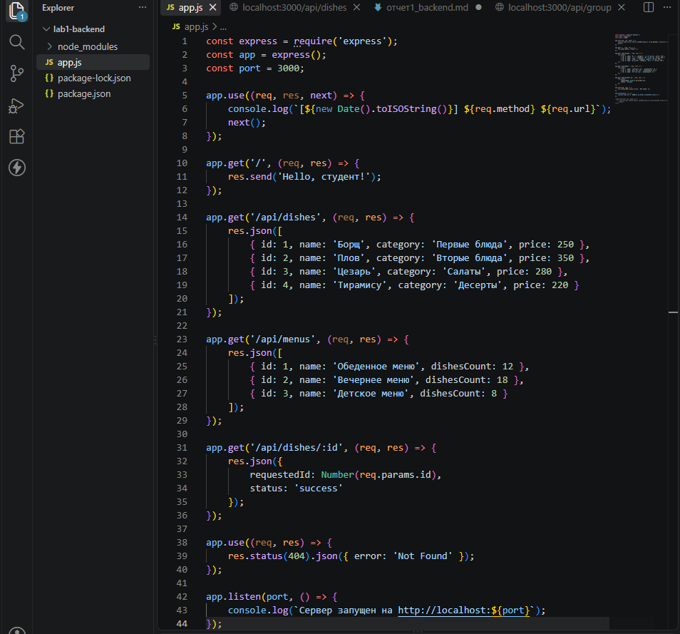
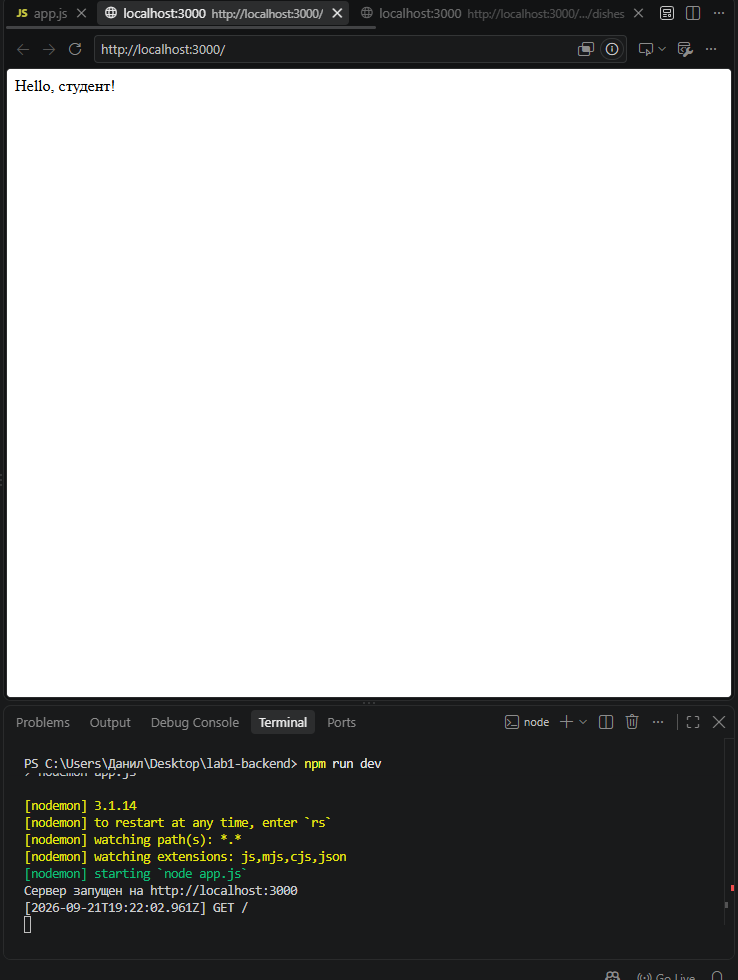
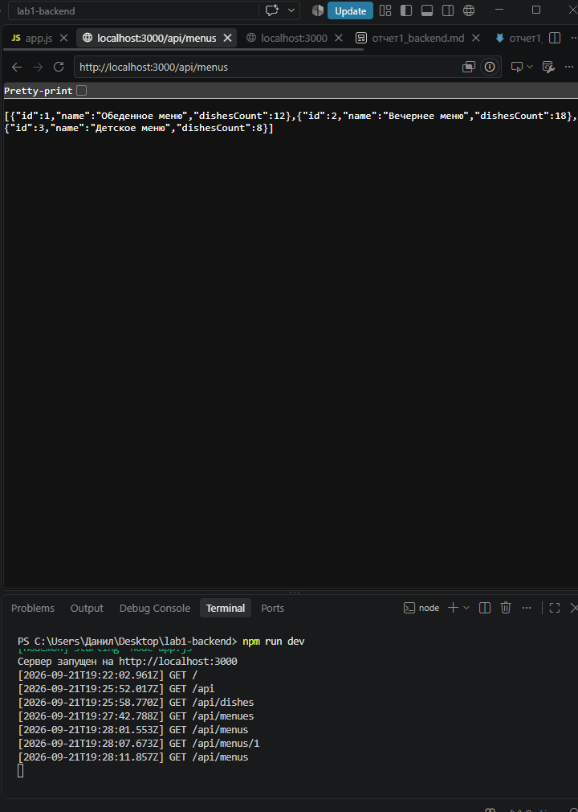
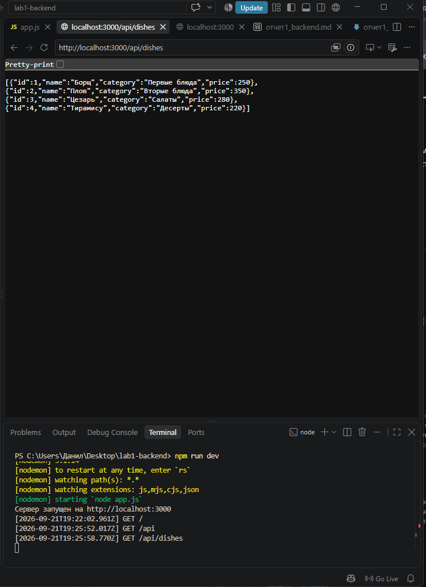
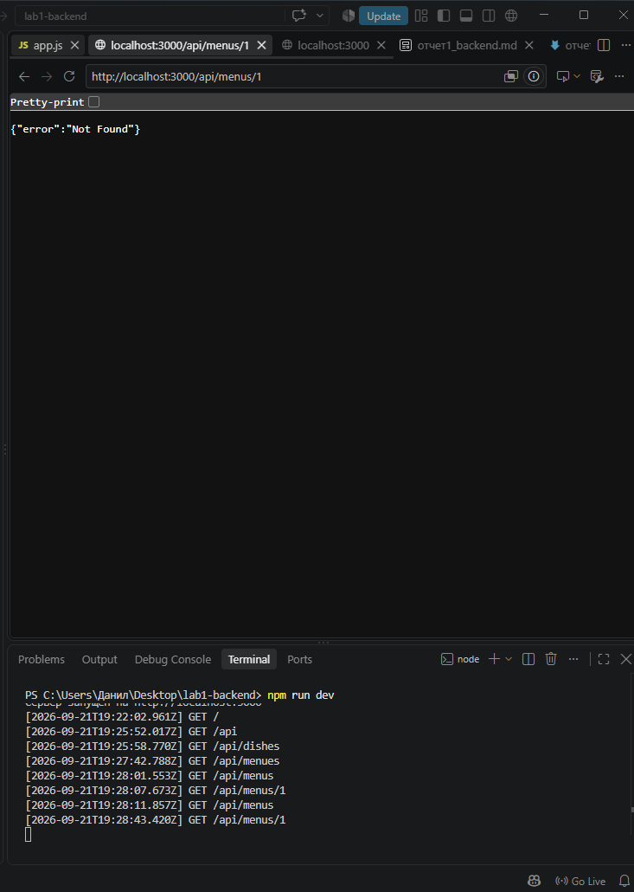

# Отчёт по лабораторной работе №1

## Настройка среды разработки и первый HTTP-сервер

### Титульный лист

**Лабораторная работа №1**

**Тема:** Настройка среды разработки и первый HTTP-сервер

**Выполнил:** Щербинин Данил Вячеславович

**Группа:** ПИЖ-б-о-25-2

**Вариант:** 14

**Дата:** 2026 г.

---

### Цель работы

Освоить установку инструментов для бэкенд-разработки, создать и запустить минимальный веб-сервер, обрабатывающий GET-запросы, понять концепцию эндпоинтов, научиться настраивать автоматический перезапуск сервера.

---

### Теоретическое обоснование

**Клиент-серверная архитектура** — это модель взаимодействия, в которой клиент (браузер, мобильное приложение, curl) отправляет запросы, а сервер их обрабатывает и возвращает ответы. В веб-разработке клиент и сервер общаются по протоколу HTTP (HyperText Transfer Protocol). Каждый запрос независим (stateless), что упрощает масштабирование, но требует дополнительных механизмов для хранения состояния (сессии, токены).

**HTTP-запрос** состоит из метода (GET, POST, PUT, DELETE и др.), URL-пути, версии протокола, заголовков и, при необходимости, тела запроса. **HTTP-ответ** содержит статус-код (200 OK, 404 Not Found, 500 Internal Server Error и др.), заголовки и тело. **Эндпоинт** — это конкретный URL-адрес, на который сервер может ответить определённым образом (например, `/api/users` или `/users/42`).

**JSON (JavaScript Object Notation)** — текстовый формат обмена данными, основанный на синтаксисе JavaScript. Он популярен благодаря читаемости, компактности и лёгкости парсинга практически на любом языке программирования. В Node.js для создания сервера часто используют фреймворк **Express**, а для автоматического перезапуска при изменении кода — пакет **nodemon**. Во Flask (Python) аналогичную роль играет режим `debug=True` со встроенным перезагрузчиком.

---

### Задание 3. Повышенный уровень

Требования:
̵ 5 эндпоинтов (1 текстовый, 2 простых JSON-эндпоинта, 1
JSON-эндпоинт с параметром в пути, 1 обработчик 404).
̵ Автоматический перезапуск.
̵ Реализация простого консольного логирования всех входящих
запросов (метод + URL + время).


Код: 



Резульат запуска сервера:


првоверка всех эндпоинтов:






---

### Ответы на контрольные вопросы

**1. Что такое клиент-серверная архитектура?**

Это модель взаимодействия, при которой клиент (браузер, мобильное приложение, curl) отправляет запросы, а сервер обрабатывает их и возвращает ответ. Клиент и сервер — независимые программы, общающиеся по сети. Каждый запрос, как правило, независим (stateless), что упрощает масштабирование, но требует дополнительных механизмов для хранения состояния (сессии, токены).

**2. Какой протокол используется для общения клиента и сервера в вебе?**

HTTP (HyperText Transfer Protocol). Для защищённого соединения — HTTPS (HTTP over TLS). HTTP определяет формат запросов и ответов, методы (GET, POST, PUT, DELETE и др.) и коды состояния.

**3. Что такое эндпоинт (endpoint)?**

Это конкретный URL-адрес (или шаблон URL), на который сервер может ответить определённым образом. Например, в моём коде `/api/dishes`, `/api/menus`, `/api/dishes/:id` — это три разных эндпоинта. Эндпоинт связывает HTTP-метод, путь и функцию-обработчик.

**4. Какую структуру имеет HTTP-запрос и HTTP-ответ? Что такое код состояния?**

HTTP-запрос состоит из: метода, URL-пути, версии протокола, заголовков и (опционально) тела. HTTP-ответ содержит: версию протокола, статус-код, заголовки и тело. Код состояния — трёхзначное число, показывающее результат обработки запроса: 200 — успех, 404 — ресурс не найден, 500 — ошибка сервера.

**5. Что такое JSON? Почему он популярен в веб-разработке?**

JSON (JavaScript Object Notation) — текстовый формат обмена данными, основанный на синтаксисе JavaScript. Популярен благодаря читаемости, компактности, лёгкости парсинга практически на любом языке и нативной поддержке в JavaScript. В моём сервере через `res.json(...)` возвращаются списки блюд и меню именно в этом формате.

**6. Как запустить сервер на Node.js или Flask?**

Node.js (Express): обычный запуск — `node server.js`, с автоматическим перезапуском — `npx nodemon server.js`. Flask: `flask run` или `python app.py` (при наличии `app.run(debug=True)`).

**7. Что такое автоматический перезапуск сервера и зачем он нужен? Какой пакет используется для Node.js?**

Это функция, при которой сервер автоматически перезапускается при изменении файлов проекта. Это ускоряет разработку — не нужно каждый раз вручную останавливать и запускать сервер. Для Node.js используется пакет **nodemon**.

**8. Какие коды состояния HTTP вы знаете? За что отвечает код 404?**

200 OK, 201 Created, 301 Moved Permanently, 400 Bad Request, 401 Unauthorized, 403 Forbidden, 404 Not Found, 500 Internal Server Error. Код **404** означает, что запрошенный ресурс не найден на сервере. В моём коде 404 возвращается в финальном middleware:

```javascript
app.use((req, res) => {
    res.status(404).json({ error: 'Not Found' });
});
```

**9. Что такое middleware в Express / декораторы запросов во Flask?**

Middleware в Express — это функции вида `(req, res, next)`, которые выполняются до или после обработки запроса. Они могут логировать запросы, парсить тело (`express.json()`), проверять аутентификацию. В моём сервере middleware используется для консольного логирования всех входящих запросов. Во Flask аналогичную роль играют декораторы (`@app.before_request`, `@app.after_request`).

**10. Как получить параметр из URL-пути (например, ID пользователя) в вашем фреймворке?**

В Express используется шаблон с двоеточием и объект `req.params`. Пример из моего кода:

```javascript
app.get('/api/dishes/:id', (req, res) => {
    res.json({
        requestedId: Number(req.params.id),
        status: 'success'
    });
});
```

При запросе `GET /api/dishes/3` значение `req.params.id` будет строкой `"3"`, которую я преобразую в число через `Number(...)`. Во Flask аналог: `@app.route('/dishes/<int:id>')` и параметр `id` в функции-обработчике.

---

### Вывод

В ходе лабораторной работы я освоил установку инструментов для бэкенд-разработки, создал и запустил минимальный веб-сервер на Node.js с использованием Express, обрабатывающий GET-запросы, разобрался с концепцией эндпоинтов и настроил автоматический перезапуск сервера через nodemon.
